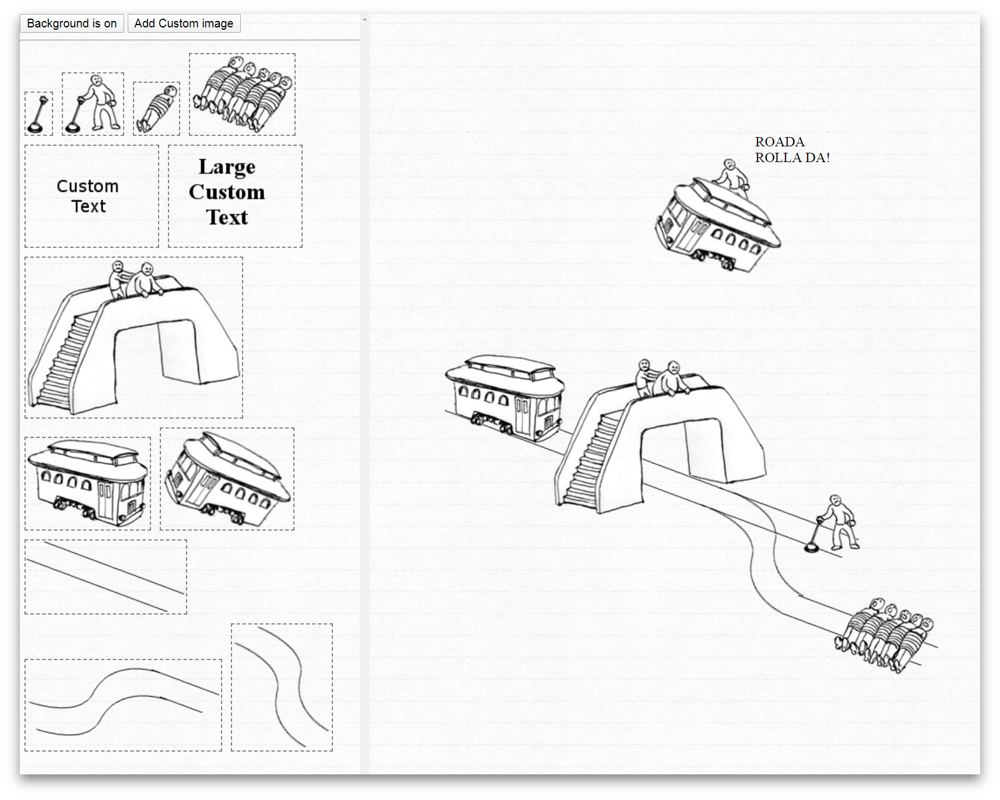

# Trolley Problem Stickers Creator

<https://trolley.tgratzer.com/>

Make your own thought experiment, create your own trolley problem with a program similar to a dress up game.

From [Wikipedia](https://en.wikipedia.org/wiki/Trolley_problem):

> There is a runaway trolley barreling down the railway tracks. Ahead, on the tracks, there are five people tied up and unable to move. The trolley is headed straight for them. You are standing some distance off in the train yard, next to a lever. If you pull this lever, the trolley will switch to a different set of tracks. However, you notice that there is one person on the side track. You have two options:
>
> 1. Do nothing and allow the trolley to kill the five people on the main track.
> 2. Pull the lever, diverting the trolley onto the side track where it will kill one person.
>
> Which is the more ethical option? Or, more simply: What is the right thing to do?
